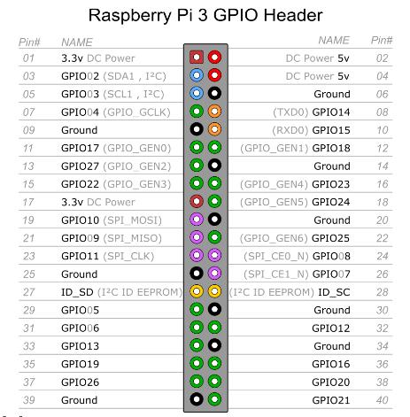

# Raspberry_pi3-GPIO
Python kullanarak gpio çıkışlarının kontrol edilmesini sağlayan graphical user interface kodudur. Raspberry pi3 cihazı üzerinde bulunan GPIO pinlerinin her biri farklı işlemler için ayrılır. GPIO başlıkları şu şekildedir;

Bu tablodan yola çıkarak kontrol edilebilen tüm çıkış pinleri için python pyqt5 kullanılarak bir arayüz tasarlanmıştır;

Burada silik olan pinlerin bazısı ground bazısı power olduğu için kullanıcı tarafından müdahale edilemeyecek şekilde ayarlanmıştır. Şeçilen checkboxlar 3,3 voltluk gerilimle çıkış verir.
